<div align="center">

  <!-- Banner SVG -->
  <a href="https://github.com/amadshobi">
    
  </a>

  <br>

  <!-- Tagline / Title -->
  <p><b>⚡ Systems Tinkerer And AI Agentic Harnesses</b></p>

  <!-- Tech Badges -->
  <p>
    
    
    
    
    
    
    <br>
    
    
    
    
    
    
  </p>

  <p align="center">
    
  </p>

  <hr>
</div>

```yaml
Identity: Ahmad Shobi Ulinnafi(amadshobi)
Role: Systems Tinkerer & AI Agentic Builder
Philosophy: First-principles engineering.
Workflow: Terminal-first & autonomous AI harnesses.
Focus: Agentic Harness
Status: Incoming CS Freshman
```

### 🛠️ Core Engineering Focus

- 👾**Agentic AI & Orchestration:** Crafting deterministic guardrails, multi-agent pipelines, MCP tools, andlocal LLM routing proxies.
- 🎭 **Developer Experience:** headless automation scripts, and ergonomic terminal utilities.
- 🐧 **Linux & System Architecture:** WSL2 mirrored networking.

---

### 📊 Contribution Activity

<div align="center">
  <a href="https://github.com/amadshobi">
    
  </a>
</div>

---

> [!TIP]
> **Engineering Mindset:** *"Stay curious, keep breaking things to learn how they work, and never stop building."* 🦫✨